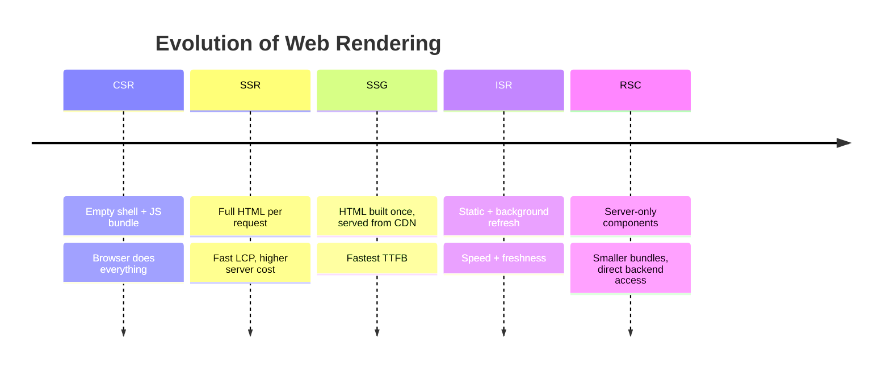
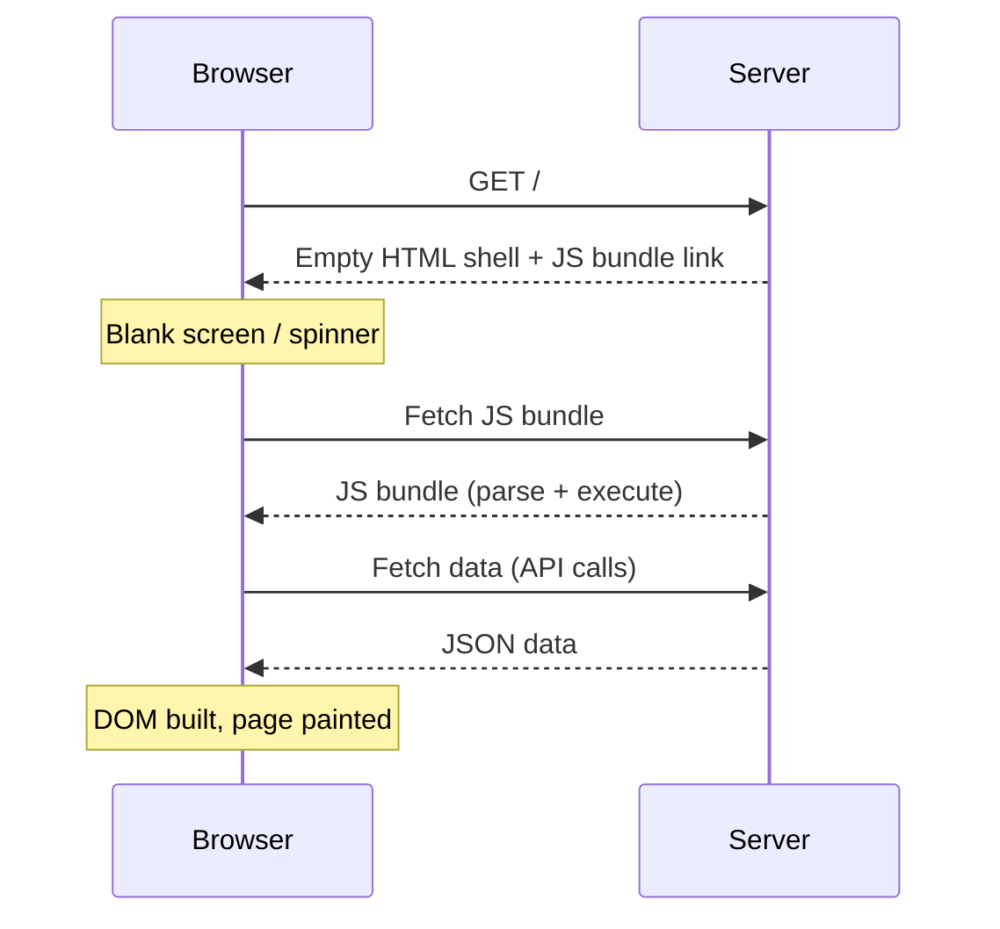
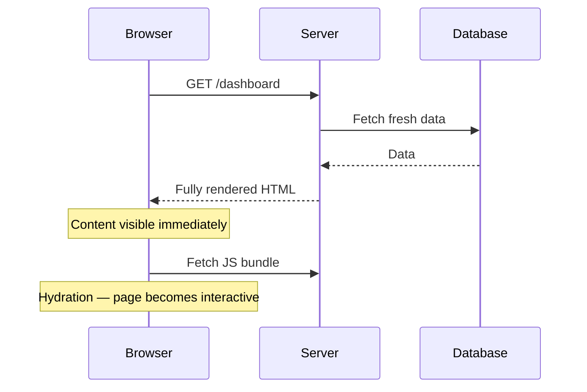
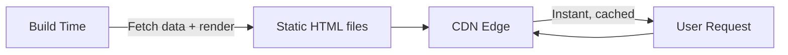
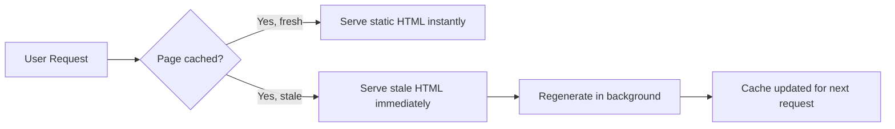
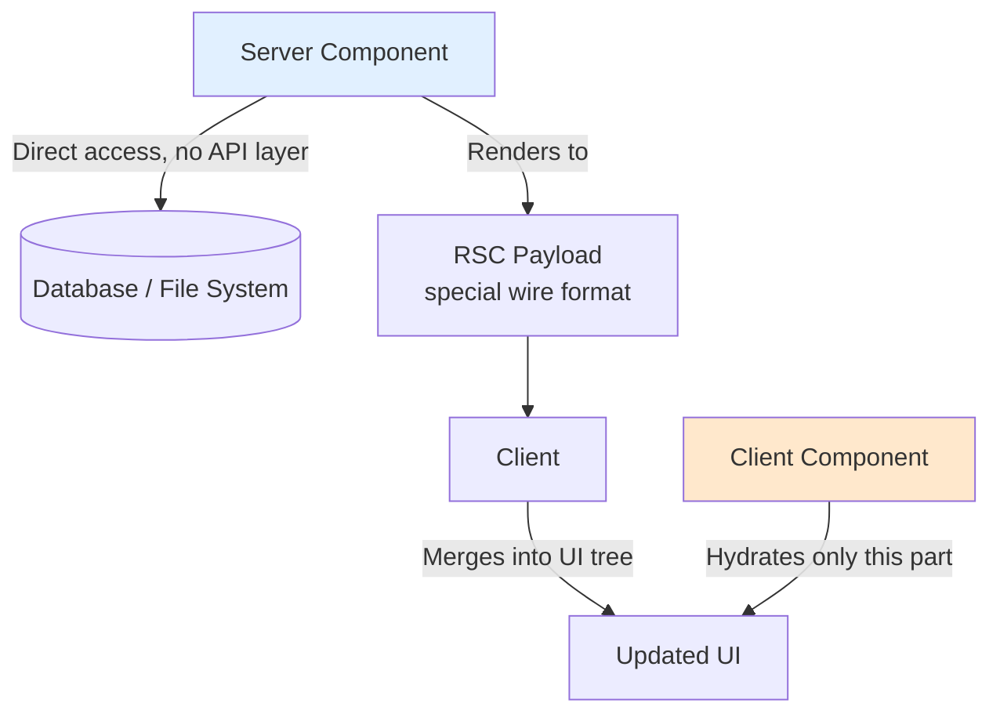
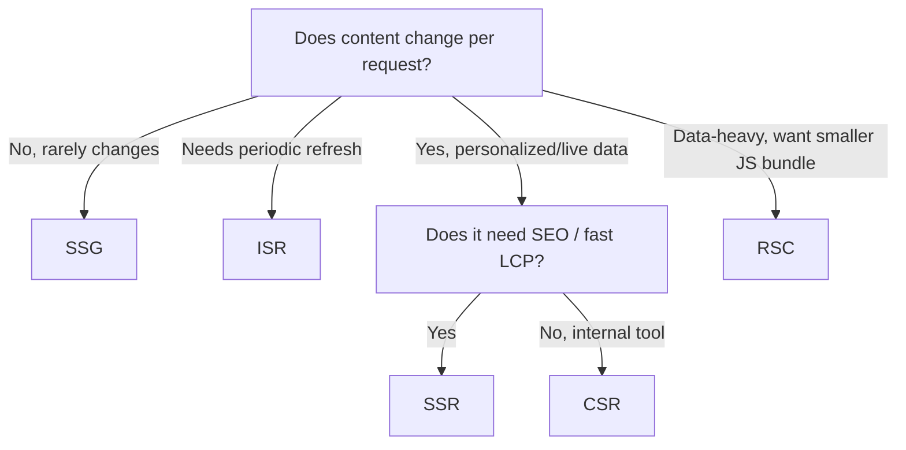
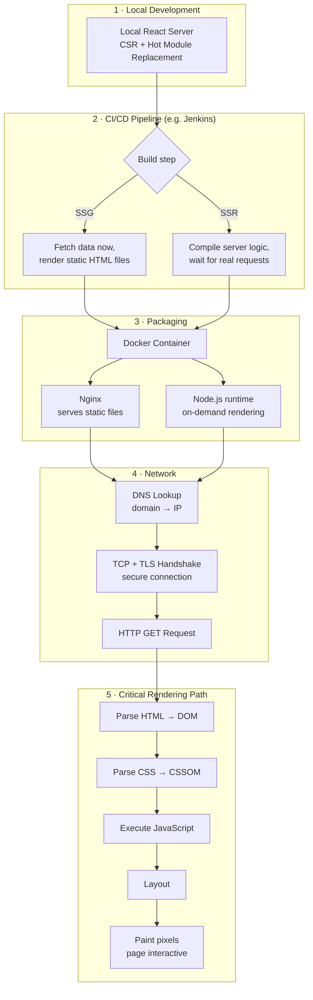

# Modern Web Rendering: CSR → SSR → SSG → ISR → RSC

A reference guide covering how web rendering evolved, when to use each strategy,
and the full journey a React app takes from local dev to painted pixels.

> Source: synthesized from personal NotebookLM study artifacts (audio + video
> transcripts on Modern Web Rendering and the React Request Journey).

---

## Table of Contents

- [0. What Does "Rendering" Actually Mean?](#0-what-does-rendering-actually-mean)
- [1. The Rendering Spectrum](#1-the-rendering-spectrum)
- [2. Client-Side Rendering (CSR)](#2-client-side-rendering-csr)
- [3. Server-Side Rendering (SSR)](#3-server-side-rendering-ssr)
- [4. Static Site Generation (SSG)](#4-static-site-generation-ssg)
- [5. Incremental Static Regeneration (ISR)](#5-incremental-static-regeneration-isr)
- [6. React Server Components (RSC)](#6-react-server-components-rsc)
- [7. Comparison Table](#7-comparison-table)
- [8. Decision Guide](#8-decision-guide)
- [9. The Full Request Journey](#9-the-full-request-journey)

---

## 0. What Does "Rendering" Actually Mean?

Every strategy in this guide is really just answering the same two
questions differently:

- **Where** does the HTML get generated — on the server, or in the user's
  browser?
- **Whose CPU** does the work — the server's, or the visitor's device?

That's it. That's the whole key word. Everything else (CSR, SSR, SSG, ISR,
RSC) is just a different combination of answers to those two questions.

| | HTML generated **where**? | Using **whose CPU**? |
|---|---|---|
| **Server-side** (SSR, SSG, ISR, RSC) | On the server (or at build time) | The server's CPU/RAM |
| **Client-side** (CSR) | In the browser, after JS runs | The user's own device |

Keep this distinction in mind through the rest of the guide — every
strategy below is just a variation on *where* the HTML gets built and
*whose compute* pays for it.

---

## 1. The Rendering Spectrum

Each step didn't replace the last — it added a new tool. Modern frameworks
(Next.js, Remix) let you mix all five **per route, even per component**.

---

## 2. Client-Side Rendering (CSR)

The server is basically a file host: it hands back an empty `
` 
and a JavaScript bundle. The browser's CPU does all the work — fetching data,
building the DOM, painting pixels.

**Optimizations:**
- **Code splitting** — only ship the JS needed for the current route
- **Prefetching** — fetch data before the user clicks

**Trade-off:** TTFB is fast, but FCP/LCP lag because the UI is gated behind
bundle download + sequential fetches.

---

## 3. Server-Side Rendering (SSR)

The server generates full HTML **on every request**, solving the blank-screen
problem.

**Best for:** dashboards, checkout pages — anywhere data freshness is
non-negotiable.

**Trade-off:** excellent LCP and SEO, but higher infra cost since the server
burns CPU/RAM per visitor.

---

## 4. Static Site Generation (SSG)

Rendering moves to **build time**. HTML is "frozen" and served from a CDN
edge — no server compute per request.

**Best for:** blogs, docs, marketing pages — content that doesn't change often.

**Trade-off:** lowest possible TTFB, but content is only as fresh as the last
build.

---

## 5. Incremental Static Regeneration (ISR)

A hybrid: pages stay static, but regenerate in the background after a set
interval.

**Best for:** e-commerce catalogs, news feeds — mostly-static content that
still needs periodic freshness.

---

## 6. React Server Components (RSC)

Not just "SSR v2." RSC lets server and client components work in true
synergy: server components never ship to the browser at all.

**Key properties:**
- Server components access DB/filesystem directly — no intermediate API
- They render to an **RSC payload**, not HTML
- Client merges the payload into the existing UI tree **without losing state**
  and **without hydrating** those server-only parts
- Can shrink client JS bundles by roughly **30–50%**

**Best for:** data-heavy, complex regions of a page where you want to
minimize what's shipped to the browser.

---

## 7. Comparison Table

| Strategy | Rendered When | TTFB | LCP | Server Cost | Best For |
|---|---|---|---|---|---|
| **CSR** | In browser | Fast | Slow (bundle-gated) | Low | SPAs, internal tools, fast HMR in dev |
| **SSR** | Per request | Medium | Fast | High (per visitor) | Dashboards, checkout, personalized pages |
| **SSG** | At build time | Fastest | Fast | Lowest (CDN only) | Blogs, docs, marketing |
| **ISR** | Build + background refresh | Fastest | Fast | Low | Catalogs, news feeds |
| **RSC** | On server, per request | Fast | Fast | Medium | Data-heavy components, minimizing JS bundle |

---

## 8. Decision Guide

---

## 9. The Full Request Journey

From `npm run dev` to painted pixels in the user's browser.

**Step-by-step:**

1. **Local dev** — CSR + HMR for fast iteration while coding
2. **CI/CD build** — the pipeline branches: SSG pre-renders HTML now; SSR only
   compiles logic and waits for a live request
3. **Packaging** — Docker containers give process isolation and environment
   consistency (Nginx for static files, Node.js for on-demand rendering)
4. **Network** — DNS resolves the domain, TCP/TLS secures the connection, the
   browser sends its `GET` request
5. **Critical Rendering Path** — parse HTML → DOM, parse CSS → CSSOM, execute
   JS, layout, then paint — this is when the user actually sees and can use
   the page

**RSC + Edge note:** for DevOps-savvy setups, moving RSC compute to the
**Edge** can drop TTFB as low as ~30ms by placing frontend logic physically
closer to both the data and the user.

---

## Quick Glossary

- **TTFB** — Time To First Byte
- **FCP** — First Contentful Paint
- **LCP** — Largest Contentful Paint
- **CRP** — Critical Rendering Path
- **RSC payload** — the wire format server components render to (not HTML)
