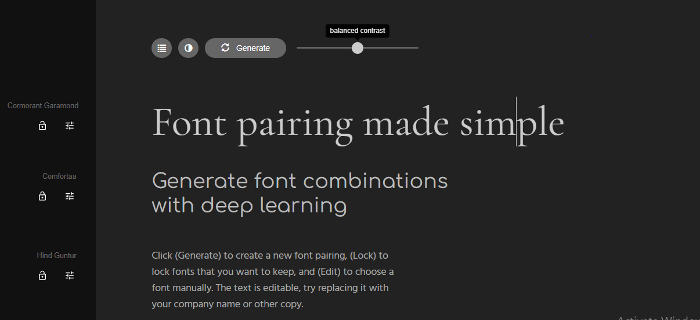
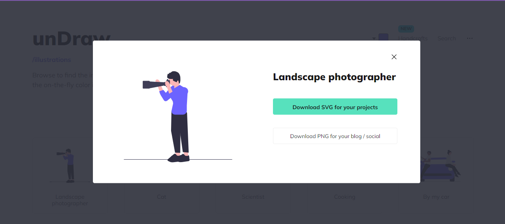
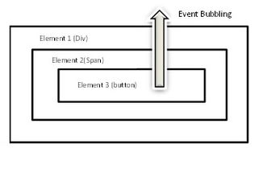
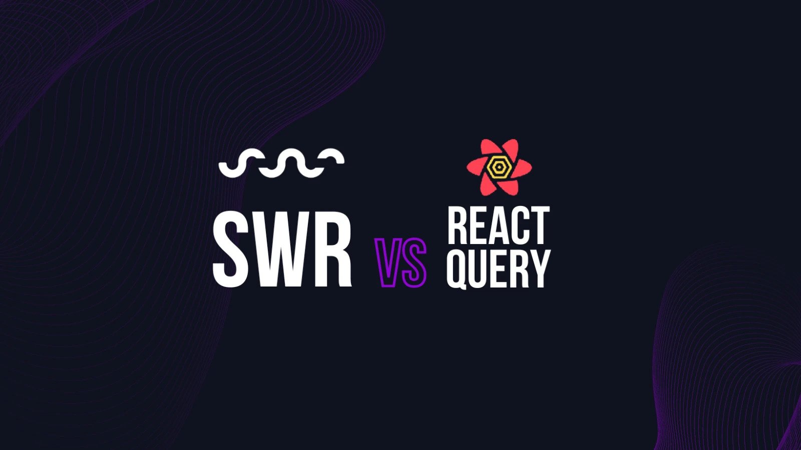
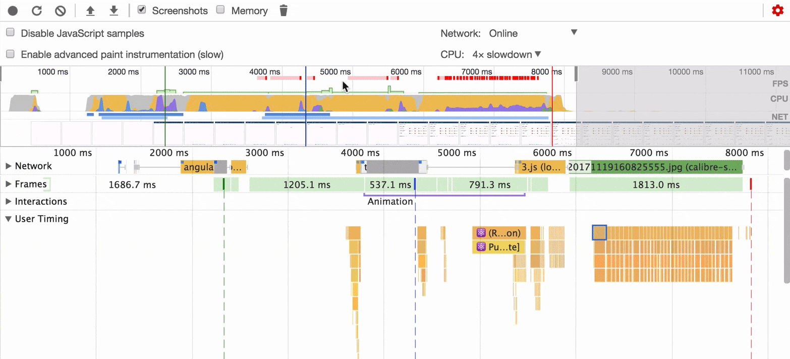

<!-- @format -->

# frontend_bookmarks


🔥Topics Here 📙
- [job seeking websites](#job-seeking-websites)
- [Typescript](#typescript)
- [Tools ⚙️⚒️](#tools-and-websites) 
- Javascript articles
- [sources](#sources)
- [code review](#code-review)


## job seeking websites

- [dev kg](https://devkg.com/ru)
- [remote ok](https://remoteok.com)
- [naukrigulf](https://www.naukrigulf.com/)


## Typescript

---

###### 01- Difference between const and readonly in typescript?

```
https://stackoverflow.com/questions/46561155/difference-between-const-and-readonly-in-typescript

```


<details><summary><b>Answer</b></summary>
<p>

they effectively both do the same thing, but one is for variables and the other is for properties.
 
 A const variable cannot be re-assigned, just like a readonly property.

Essentially, when you define a property, you can use readonly to prevent re-assignment. This is actually only a compile-time check.
 When you define a const variable (and target a more recent version of JavaScript to preserve const in the output), the check is also made at runtime.
 
 ```
 const x = 5;

// Not allowed
x = 7;


class Example {
    public readonly y = 6;
}

var e = new Example();

// Not allowed
e.y = 4;
 ```
 
 Important note... "cannot be re-assigned" is not the same as immutability.

```
 const myArr = [1, 2, 3];

// Not allowed
myArr = [4, 5, 6]

// Perfectly fine
myArr.push(4);

// Perfectly fine
myArr[0] = 9;
 
 ```

</p>
</details>

---


## sources 

- [smashing Magazine](https://www.smashingmagazine.com/)


## Tools and websites

- [X] [Pair Typography fonts](https://fontjoy.com/) 
 
 
- [X] [empty views svgs](https://undraw.co/illustrations)
 


## bookmark for javascript articles 

- [ ] javascript-visualized-event-loop-3dif article lidia

  - [javascript-visualized-event-loop-3dif article lidia](https://dev.to/lydiahallie/javascript-visualized-event-loop-3dif)

- [ ] 7-shorthand-optimization-tricks-every-javascript-developer-should-know
  - [7-shorthand-optimization-tricks-every-javascript-developer-should-know](https://tapajyoti-bose.medium.com/7-shorthand-optimization-tricks-every-javascript-developer-should-know-bf4e136d4497)
- [ ] frontend desgin helper websites
  - [front end desgin helper websites](https://www.linkedin.com/feed/update/urn:li:activity:6995829940541644800/?utm_source=share&utm_medium=member_android)
- [ ] js interview questions

  - [Javascript interview questions](https://www.linkedin.com/feed/update/urn:li:activity:6995420810395992064/?utm_source=share&utm_medium=member_android)
  


* > Event propagation

   

- [x] A simplified explanation of event propagation in JavaScript.
  - [A simplified explanation of event propagation in JavaScript.](https://www.freecodecamp.org/news/a-simplified-explanation-of-event-propagation-in-javascript-f9de7961a06e/)

- [X] SWR vs react query vs axios vs fetch
* > - [SWR](https://www.smashingmagazine.com/2020/06/introduction-swr-react-hooks-remote-data-fetching/#:~:text=Axios%20or%20Fetch%20will%20just,built%20on%20top%20of%20it.)

###### ❔ 👽 what is the difference between types and interface?
<details><summary><b>Answer</b></summary>
<p>

https://stackoverflow.com/questions/37233735/interfaces-vs-types-in-typescript

</p>
</details>

# My questions while learning ReactJS,NetxJS,...
---
> ## React Query 
   


###### 00- What is the main difference between React Query and Redux?
###### 01- can react query replace Redux toolkit?

```
   currently I am using redux in different projects for state management. A few days back, I listened about react-query
   which is also used for state management and provides caching and async fetching. I am trying to figure out the main difference
   between these two libraries. Where I should use react-query and in which cases I need redux.

```


<details><summary><b>Answer</b></summary>
<p>

React-query is what you would call a specialized library. It holds an api cache for you - nothing else. And since it is specialized, it does that job quite well and requires less code.

Redux on the other hand gives you tools to just about store anything - but you have to write the logic. So you can do a lot more in Redux, but you'll have to potentialy write code that would not be necessary with a specialized library.

You can use them both side-by-side: api cache in react query, rest of your global state in Redux.

That said, the official Redux Toolkit also ships with an api cache abstraction RTK Query since version 1.6 with a similar feature set as React Query, but some different concepts overall - you might also want to check that out.

</p>
</details>


---

###### 02- Lorem question?

```
 Lorem ipsum dolor sit amet consectetur adipisicing elit. Maxime mollitia,
molestiae quas vel sint commodi repudiandae consequuntur voluptatum laborum
numquam blanditiis harum quisquam eius sed odit fugiat iusto fuga praesentium
optio, eaque rerum! Provident similique accusantium nemo autem. Veritatis
obcaecati tenetur iure eius earum ut molestias architecto voluptate aliquam
nihil, eveniet aliquid culpa officia aut! Impedit sit sunt quaerat, odit,

```


<details><summary><b>Answer</b></summary>
<p>

Lorem ipsum dolor sit amet consectetur adipisicing elit. Maxime mollitia,
molestiae quas vel sint commodi repudiandae consequuntur voluptatum laborum
numquam blanditiis harum quisquam eius sed odit fugiat iusto fuga praesentium
optio, eaque rerum! Provident similique accusantium nemo autem. Veritatis
obcaecati tenetur iure eius earum ut molestias architecto voluptate aliquam
nihil, eveniet aliquid culpa officia aut! Impedit sit sunt quaerat, odit,

</p>
</details>

---


> ## SWR VS react query

---


###### 02- When to use SWR ,react query or RTK query?

```
All of them add enhance to [fetch or Axios] by caching,pagination,preservce page postion,revalidation,interval refetching

```
   


<details><summary><b>Answer</b></summary>

They are the same but my peripheral is 
  - when the app uses ReduxTool kit i will use RTK Query
  - when the app uses simple state i will use react Query
  - SWR is more intended to get data, not update it, usually you have another function to update and after it you will run mutate to update the cache and trigger a revalidation (SWR will fetch it again)


</details>

---

###### 03- What to do when creating React app from scratch?

```
Can you describe what will you think about when creating react app from scratch

```
  


<details><summary><b>Answer</b></summary>


</details>

---

---

###### 04- What you will do to increase performance in react?



```
Not doing things take less time than doing things

```
  


<details><summary><b>Answer</b></summary>

- push state down the tree so not to rerender heavy siplings components   [working with component hierarchy ]
- Pulling content up what i mean is :                                     [working with component hierarchy ]
 
 ```
  if the problem is 
  
 > app.js
 ========
     <WrapperComponent/>
 
 
 > WrapperComponent.js
 ===========
 
    <simpleComponent/>
    <HeaveryComponent/>
 
 
 solution will be 
 
 app.js
 ======
 <WrapperComponent>
  <SimpleComponent/>
 </WrapperComponent>
 
 > WrapperComponent.js
 
 {children}
 <HeavyComponent/>
 
 
 > children it treated as it's not sipling of HeavyComponent  😛😛😛
 
 
 ```

 - useMemo 
 - useCallback


</details>

---

## code review
[read this article and write your checklist](https://pagepro.co/blog/18-tips-for-a-better-react-code-review-ts-js/)


